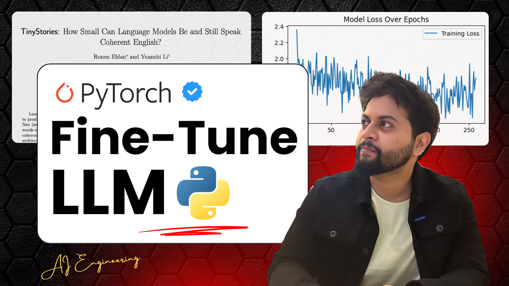
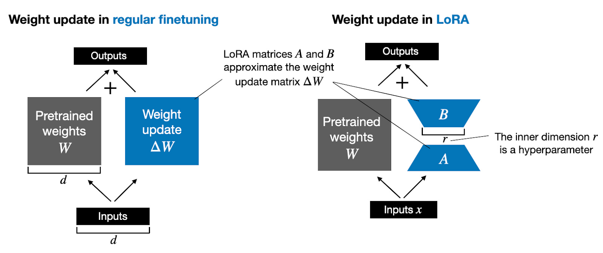
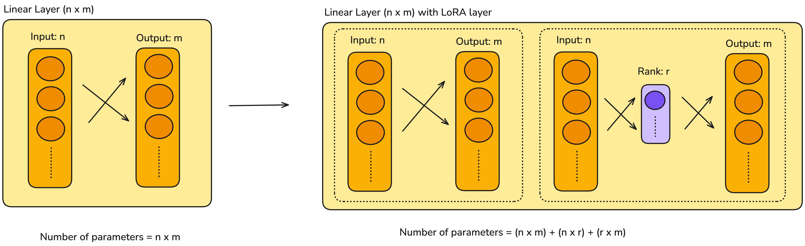
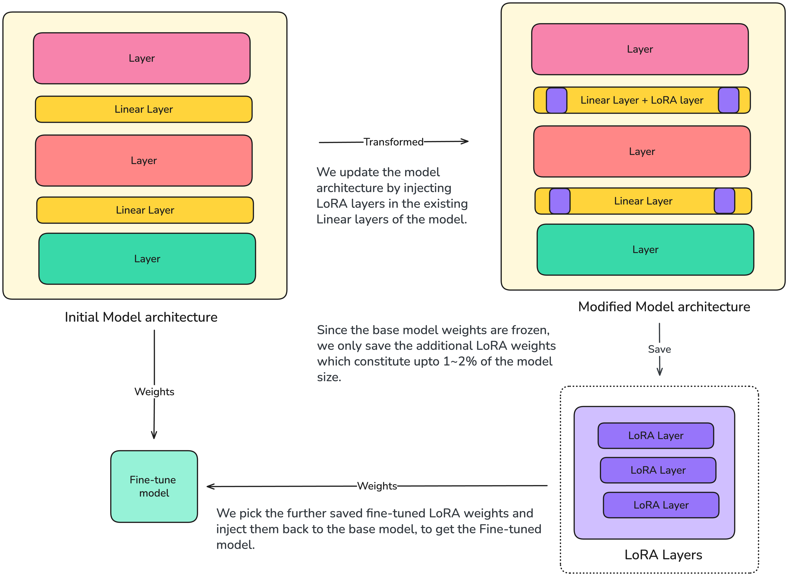

# :rocket: Fine-tuning LLMs from scratch

[](https://opensource.org/licenses/MIT)
[](https://www.python.org/)
[](https://pytorch.org/)

This repo holds a collection of Jupyter notebooks to fine-tune Large Language Models from scratch.


> Research shows that the pattern-recognition abilities of foundation language models are so powerful that they sometimes require relatively little additional training to learn specific tasks. That additional training helps the model make better predictions on a specific task. This additional training, called fine-tuning, unlocks an LLM's practical side.

Read more about Fine-tuning process here: [View](https://developers.google.com/machine-learning/crash-course/llm/tuning).

## Contents:

- :star2: [Notebook](./fine-tune-gpt2-spam-classifier.ipynb): Fine-tune [GPT2 (Small)](https://huggingface.co/openai-community/gpt2) 125 Million parameter model for classifying spam messages.
- :sunflower: [Notebook](./fine-tune-tiny-stories.ipynb): Fine-tune [TinyStories 19M](https://huggingface.co/SauravP97/tiny-stories-19M) model to summarize stories.
- :rocket: [Notebook](./fine_tune_llama_1b_summarization.ipynb): Fine-tune Meta [Llama 3.2](https://huggingface.co/meta-llama/Llama-3.2-1B) 1 billion parameter model on text summarization task.
- :panda_face: [Notebook](./gemma4_fine_tune.ipynb): Fine-tune Google's [Gemma 4](https://huggingface.co/google/gemma-4-E2B) 2 billion parameter model on QnA task.

### Video Playlist - LLM Fine-tune :arrow_forward:

Checkout my [YouTube](https://www.youtube.com/@saurav_prateek_) playlist on Fine-tuning LLMs where I have covered the notebooks present in this repo in detail.

<a href="https://www.youtube.com/playlist?list=PL3tZ_eA1QJsypKE4HUc5KdZUfa7OhHJan"></a>


---

### :gear: Fine-tune Meta Llama 3.2 (1 billion parameters) model using LoRA

[Notebook](./fine_tune_llama_1b_summarization.ipynb): Fine-tune [Llama 3.2](https://huggingface.co/meta-llama/Llama-3.2-1B) 1 Billion parameter model for summarization task using LoRA.

We use [LoRA](https://huggingface.co/docs/diffusers/en/training/lora) technique to fine-tune Meta's [Llama-3.2](https://huggingface.co/meta-llama/Llama-3.2-1B) 1 Billion parameter model for the summarization task. We have used LoRA to avoid training the entire 1 billion parameters of the model. Since the model is pre-trained and has a decent understanding of language, we can attach additional layers and explicitly train them while keeping the rest of the model weights frozen.

- Frozen Model parameters = `1,235,814,400`
- Trainable Model parameters = `13,357,056`

What is LoRA?

> LoRA (Low-Rank Adaptation of Large Language Models) is a popular and lightweight training technique that significantly reduces the number of trainable parameters. It works by inserting a smaller number of new weights into the model and only these are trained.

For our use case, I have inserted additional LoRA layers with all the Linear layers present in the Llama model.
The LoRA layer looks somewhat like this.



```python
class LoRALayer(torch.nn.Module):
  def __init__(self, in_dim, out_dim, rank, alpha):
    super().__init__()
    self.A = torch.nn.Parameter(torch.empty(in_dim, rank, dtype=torch.bfloat16))
    torch.nn.init.kaiming_uniform_(self.A, a=math.sqrt(5))
    self.B = torch.nn.Parameter(torch.zeros(rank, out_dim, dtype=torch.bfloat16))
    self.alpha = alpha
    self.rank = rank

  def forward(self, x):
    x = (self.alpha / self.rank) * (x @ self.A @ self.B)
    return x
```

I have clubbed the above shown LoRA Layer with all the Linear Layers present in the Llama model. The model architecture before and after the LoRA layer integration is shown below.



### :partly_sunny: Saving the Fine-tuned model

