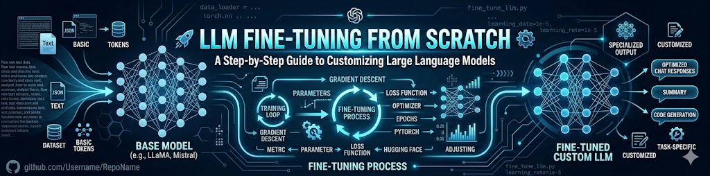
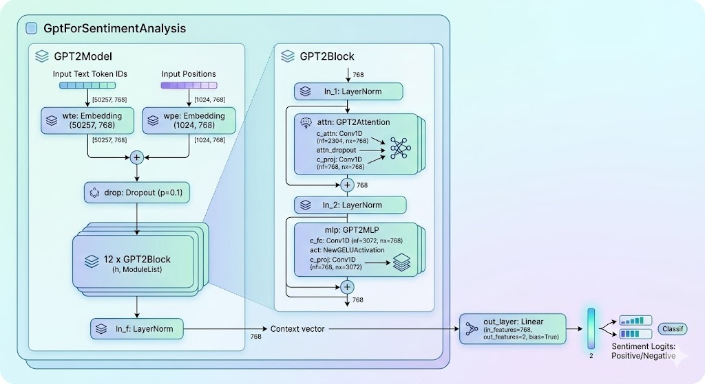

# Fine-tuning LLMs from scratch

This repo holds a collection of Jupyter notebooks to fine-tune Large Language Models from scratch.

> Research shows that the pattern-recognition abilities of foundation language models are so powerful that they sometimes require relatively little additional training to learn specific tasks. That additional training helps the model make better predictions on a specific task. This additional training, called fine-tuning, unlocks an LLM's practical side.

Read more about Fine-tuning process here: [View](https://developers.google.com/machine-learning/crash-course/llm/tuning).

## Contents:

### :rocket: Fine-tune GPT2 (Small) 125 Million parameter model for classifying spam messages. [View Notebook](./fine-tune-gpt2-spam-classifier.ipynb)

